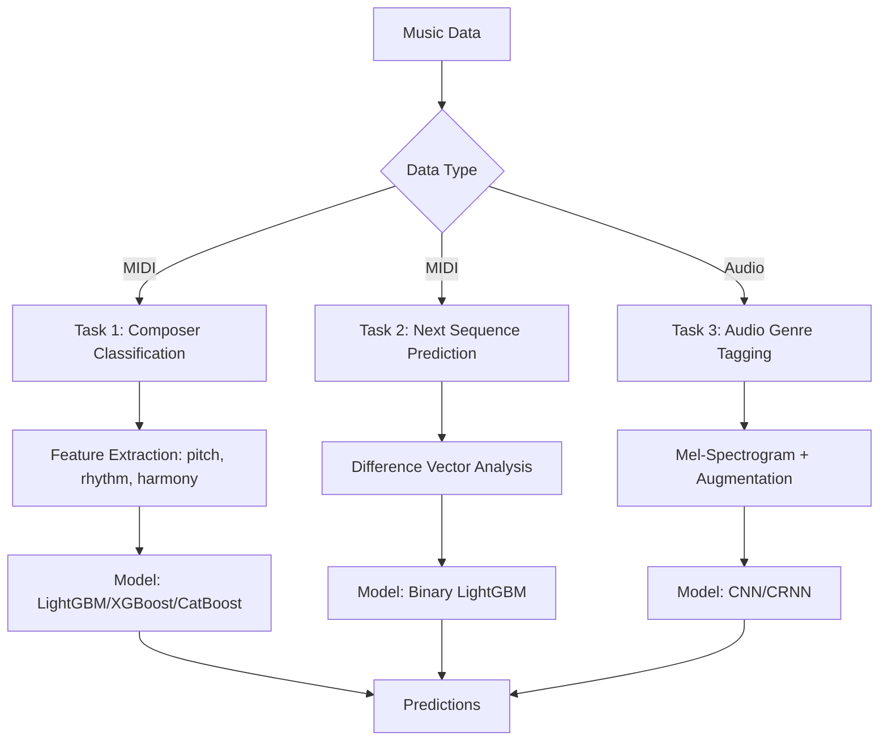

# 🎹 Composer Classification & Music Sequence Prediction

This repository contains a comprehensive suite of machine learning and deep learning tools for **Music Information Retrieval (MIR)**. The project addresses three distinct challenges: identifying composers from MIDI patterns, predicting musical continuity, and multi-label audio genre tagging.

---

## 📊 Project Workflow



---

## 🎵 Project Overview

By combining symbolic music processing (MIDI) with raw audio analysis, this project explores the boundaries of computational musicology. We use a multi-faceted approach to extract meaningful descriptors from music:
- **Symbolic Analysis**: Extracting stylistic signatures from MIDI using `pretty_midi` and `music21`.
- **Acoustic Analysis**: Processing raw audio via Mel-Spectrograms to capture timbre and texture.
- **Predictive Modeling**: Leveraging state-of-the-art Gradient Boosting (GBDT) and Deep Neural Networks (CNN/RNN).

---

## 🚀 Tasks & Methodology

### 1️⃣ Composer Classification
**Goal**: Identify the composer of a MIDI composition among multiple candidates.
- **Key Features**:
  - **Pitch Dynamics**: Range, mean frequency, skewness, and octaval distribution.
  - **Rhythmic Styles**: Note density, duration entropy, legato ratios, and rest proportions.
  - **Advanced Musicality**: Chord entropy (triad analysis), time signature parsing, beat strength, and sustain pedal usage.
- **Optimization Strategy**:
  - **Feature Selection**: We performed gain-based feature selection to remove low-impact descriptors (e.g., `pitch_kurtosis`, `offbeat_ratio`), focusing on high-signal variables like `note_density` and `chord_entropy`.
  - **Balancing**: Utilized `compute_sample_weight` to handle class imbalances across different composers.

### 2️⃣ Next Sequence Prediction
**Goal**: Predict whether two music segments are chronologically consecutive.
- **Algorithm**: A "Siamese-like" feature comparison.
  - Step 1: Extract stylistic vectors $V_1$ and $V_2$ for two segments.
  - Step 2: Compute the absolute L1 distance: $D = |V_1 - V_2|$.
  - Step 3: Train a **LightGBM** binary classifier on $D$ to identify continuity.
- **Logic**: Consecutive segments from the same piece exhibit high stylistic consistency, resulting in minimized feature deltas.

### 3️⃣ Audio Genre Tagging
**Goal**: Assign multiple genre tags (e.g., *Jazz, Rock, Electronic*) to raw audio files.
- **Processing Pipeline**:
  - **Log-Mel Spectrograms**: 64 Mels, 16kHz sample rate, 10s segments.
  - **Data Augmentation**: Heavy use of Gaussian noise, random cropping, SpecAugment (time/frequency masking), and volume jittering.
- **Model Architecture (CRNN)**:
  - **CNN**: 2D-Convolutional filters (3x3) to capture local "visual" patterns in the spectrogram.
  - **RNN**: A **Bidirectional GRU** layer processes the output of the CNN to learn long-term temporal dependencies in the music.
  - **Pooling**: Global average pooling across the time dimension before the final classification layer.

---

## 📂 Repository Structure

| File | Description |
| :--- | :--- |
| `task1_composer.py` | MIDI feature extraction and composer classification pipeline. |
| `task2_sequence.py` | Sequence continuity prediction using feature delta analysis. |
| `task3_audio.py` | Multi-label audio classification with CNN/CRNN models. |
| `all_code.py` | Unified research script containing experimental code and ablation studies. |
| `student_files/` | **[External]** Primary dataset directory (see Setup). |
| `predictions1-3.json` | Generated output files for evaluation. |

---

## 🛠️ Setup & Installation

### 1. Requirements
Ensure you have Python 3.8+ installed. The project depends on several specialized music processing libraries:

```bash
pip install torch torchaudio librosa pretty_midi music21 pandas numpy \
            scikit-learn lightgbm xgboost catboost tqdm miditoolkit soundfile statsmodels
```

> [!IMPORTANT]
> Some advanced features in `task1` rely on `music21`'s `chordify()` and `SustainPedal` analysis, which can be computationally expensive. Cache features using the provided `.pkl` utility whenever possible.

### 2. Dataset Configuration
The datasets are provided as `student_files.zip`. Please ensure the following structure:
```text
.
├── student_files/
│   ├── task1_composer_classification/
│   ├── task2_next_sequence_prediction/
│   └── task3_audio_genre_tagging/
├── ...
└── README.md
```

---

## 📊 Evaluation & Performance

- **Metrics**: 
  - **Accuracy/F1** for symbolic tasks.
  - **mAP (mean Average Precision)** for multi-label audio tagging.
- **Optimization Tip**:
  > [!TIP]
  > For **Task 3**, using a GPU significantly reduces training time from ~2 hours to ~10 minutes per experiment. The code automatically detects CUDA if available.

## 📝 Usage

Run the individual task workers:
```powershell
python task1_composer.py
python task2_sequence.py
python task3_audio.py
```

The system will automatically cache extracted features into `.pkl` files (e.g., `f1.pkl`) to accelerate subsequent runs.
